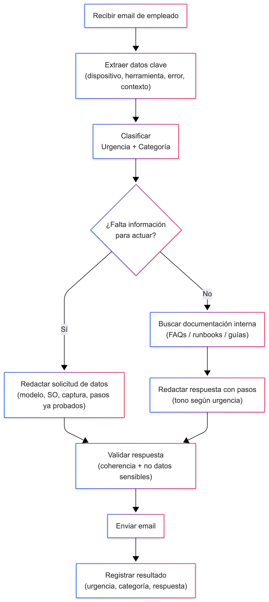

## Caso de uso: Help Desk de oficina

### Lo que el agente debería hacer:

* Leer solicitudes enviadas por los empleados (email o formulario)
* Clasificar el problema por **tipo** (hardware, software, accesos, solicitudes) y **urgencia**
* Consultar documentación interna o procedimientos de IT
* Redactar una respuesta o propuesta de acción (resolución o escalado)

---

### Ejemplos de posibles escenarios:

* *“Mi portátil no enciende desde esta mañana”*
* *“Necesito que me instalen Visual Studio en el equipo”*
* *“He cambiado de móvil y no puedo acceder al correo corporativo”*

---

## Workflow del agente

## Tipos de nodos

* Data: extraer datos del texto, buscar en KB

* LLM: clasificar + redactar

* Action: enviar email

